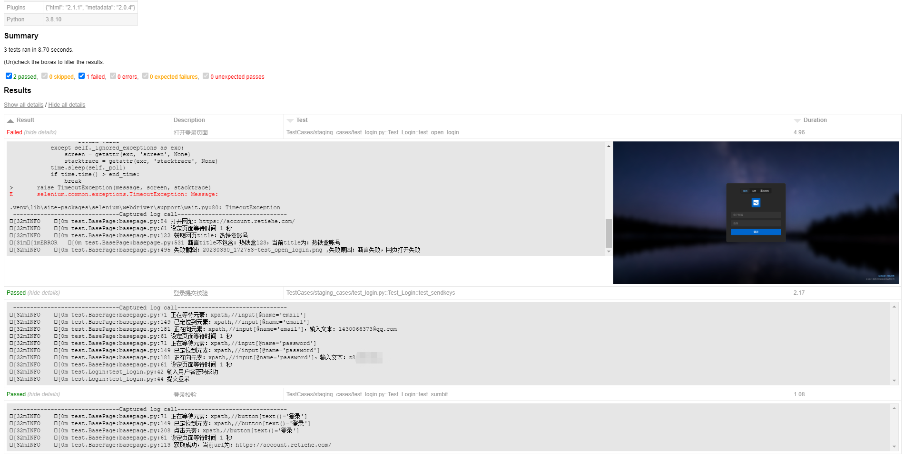

# Pytest+Selenium+pytest-html
>虚拟环境：Python 3.8.5 x64、selenium 3.14.1、pytest 7.0.1、pytest-html 2.1.1
### 特点
- 支持自定义命令行参数运行用例
- 支持pytest-html报告内容，加入失败截图、用例描述、显示运行日志
- basepage中二次封装selenium基础方法简化用例编写
- PageObject定义页面基础元素及操作方法，TestCases中可以直接调用编写封装好方法
- 支持多种断言
- 支持邮件发送报告

### 目录
- Common：二次封装库
- Setting：存放数据库配置
- Driver：存放WebDriver驱动
- File：存放pytest-html测试报告、截图、上传和下载的文件
- PageObject：存放封装的元素定位对象
- TestCases：存放测试用例

### 本地部署
1. 创建虚拟环境  
`python -m venv .venv`
2. 命令行设置虚拟环境 或 手动在PyCharm>Setting>Python Interpreter中选择`venv`环境  
`.venv/Scripts/activate`
3. 若是在VSCode中使用虚拟环境，请进行以下操作  
`Setting中搜索Venv Path，填写创建的.venv路径`
4. 使用国内镜像安装第三方库  
`pip install -r requirements.txt https://mirrors.aliyun.com/pypi/simple/`
5. 安装ChromeDriver驱动  
>请更新与自己Chrome版本一致的ChromeDriver插件，放置Driver目录下  
[ChromeDriver下载地址](http://npm.taobao.org/mirrors/chromedriver/) 

### 使用说明
1. 页面操作方法库 
>basepage中二次封装的基础方法及断言  
[Automation_Function](https://cxqzok4p36.feishu.cn/sheets/shtcniVJ2sMUBzCBfIQvu2PwQfe)
2. 定义元素时，请使用(方法名，定位值)的方式
- xpath定位：b_sumbit = 'xpath,//*[contains(@type,"submit")]'  # 提交按钮
- id定位：i_username = 'id,username'   # 用户名输入框
- 必须使用 id/name/class/tag/link/plink/xpath/css 任意方式定位

### 命令行参数
Demo只添加了一个环境参数-e, 可设置测试环境staging，预发环境prepord，如要在测试环境运行，需要运行run.py或终端输入：
> python run.py -e staging

### 运行示例
登录测试用例
